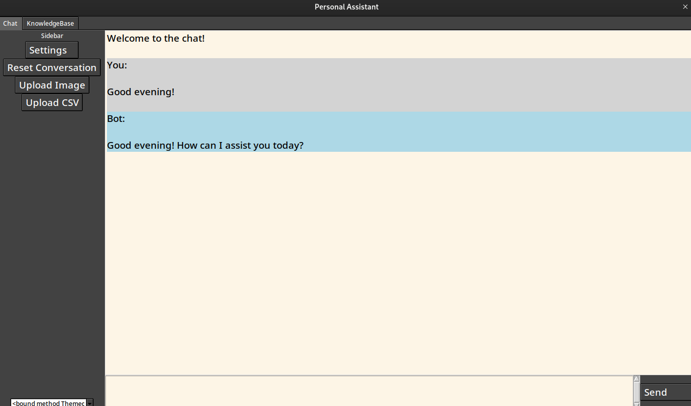
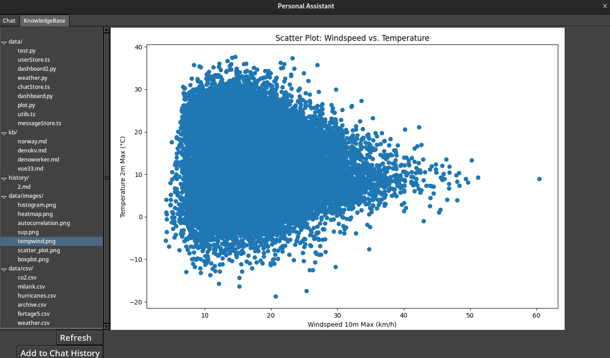
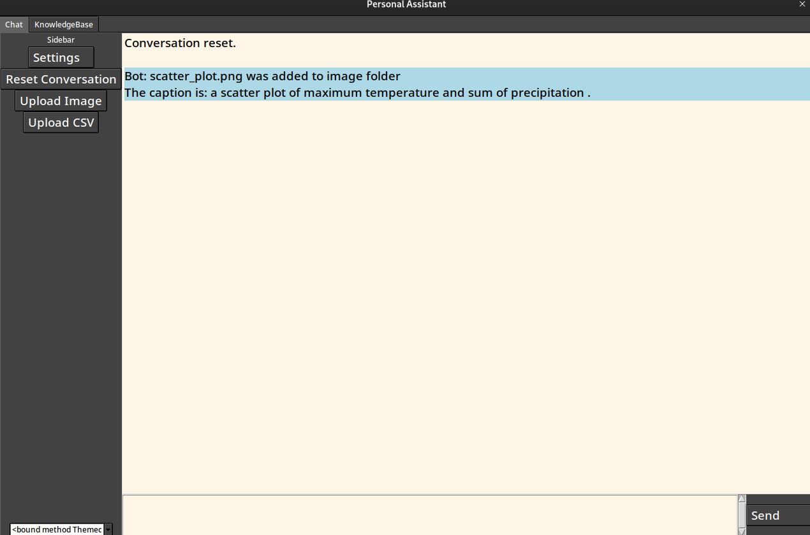
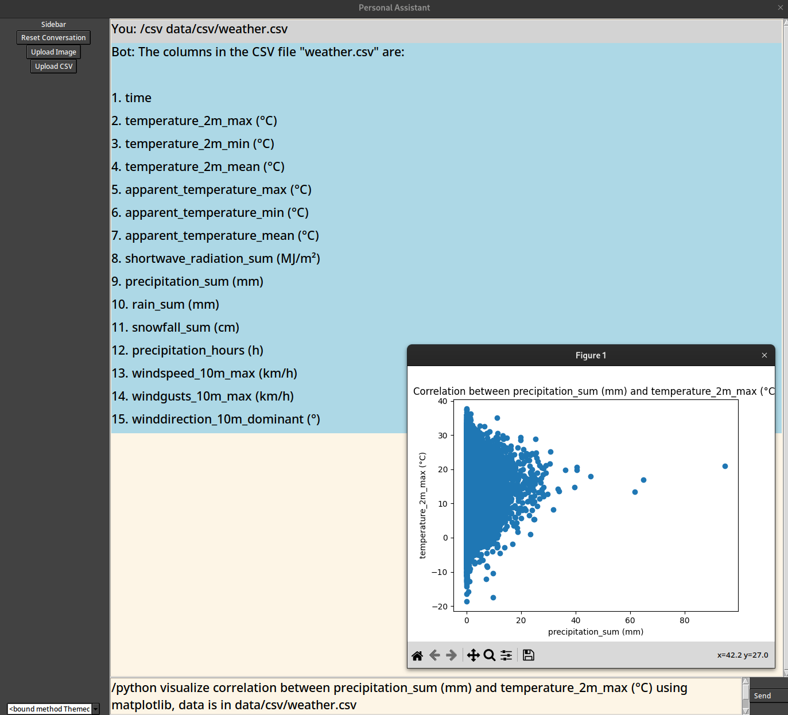

# GPT-UglyUI

## Table of Contents

- [Description](#description)
- [Functions](#functions)
- [Usage](#usage)
- [Screenshots](#gui-screenshots)
  - [Chat UI](#chat-ui)
  - [File-Manager](#file-manager)
  - [Image to Text](#image-to-text)
  - [Read CSV and Plot with Python](#read-csv-and-use-python-to-plot-older-gui)
  - [Tabs (Knowledgebase, History, Images)](#tabs-knowledgebase-history-images)

## Description

GUI chatbot playground with the new functions feature.

* Somewhat basic GUI - Not threaded, so it freezes when the bot is thinking.
* History is in practice in memory (though you can save files with functions so, summarize and save)
* I have begun an attempt at adding a tab for Pinecone indexe, where you can search and view results. (very early days)
* File manager - can load file content into  chat history, to "talk to files" - supports most text based files.

### Limitations

* Very much single threaded so the GUI freezes when the bot is thinking.
* Can not copy from the chat window. (Workaround, ask it to write to file)
* I don't know python.
* Probably many more.

## Functions

* /python - run python code
* /wikidata - query wikidata
* /image - convert an image to text caption using Coca, based on CoCa clone from: https://huggingface.co/spaces/fffiloni/CoCa-clone
* /scrape - scrape a webpage
* /write_code - write a file to disk
* /kb [list/read/create] - knowledgebase interaction
* /history [list/read/write] - history interaction
* /csv - read columns from a csv file
* /read_file - read a file
* /edit_file - edit a file - Useful to read_file first, so the bot knows what lines are where. 

### Not "functions" but commands/strict prompts

* /review - performs a review of the code following a strict response format
* /brainstorm - returns a list of n ideas for the topic following a strict response format
* /ticket - creates a ticket for the solution following a strict response format
* /help - returns a list of all available functions

Example Usecase: /read_file code.ts/py/rs/etc -> /review -> /edit_file code.ts/py/rs/etc

## Usage

* Create a .env file in the root of the project:
  - OPENAI_API_KEY=your-api-key
  - PINECONE_API_KEY=your-api-key
  - PINECONE_ENVIRONMENT=your-environment
* `pip install -r requirements.txt` to install dependencies
* `python main.py` to run the chatbot
* To use as CLI tool:

In `main.py` comment out the entire GUI section and uncomment the CLI section.

## GUI Screenshots

### Chat UI

### File-Manager

### Image to Text

### Read CSV and Use Python to plot (older GUI)

