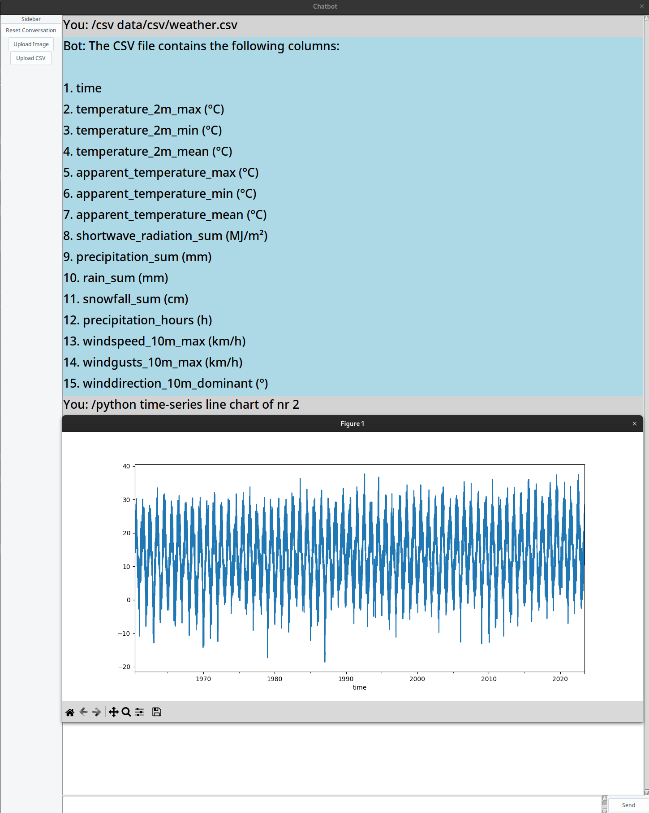
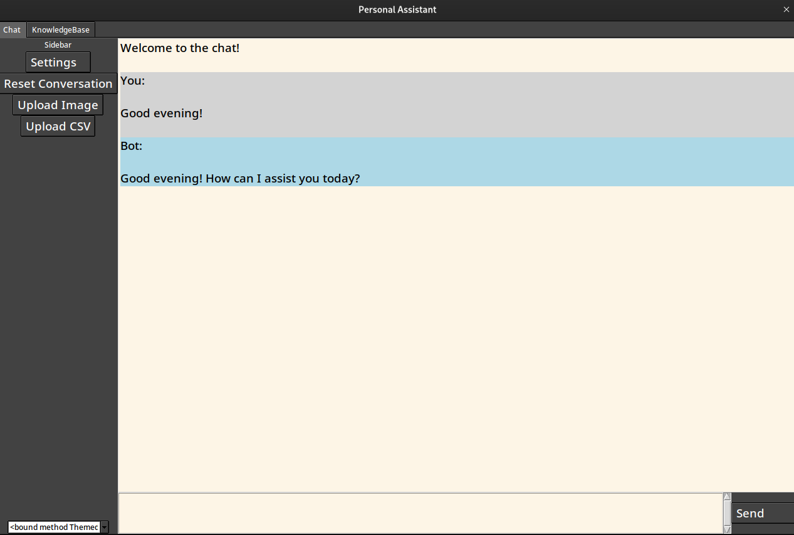
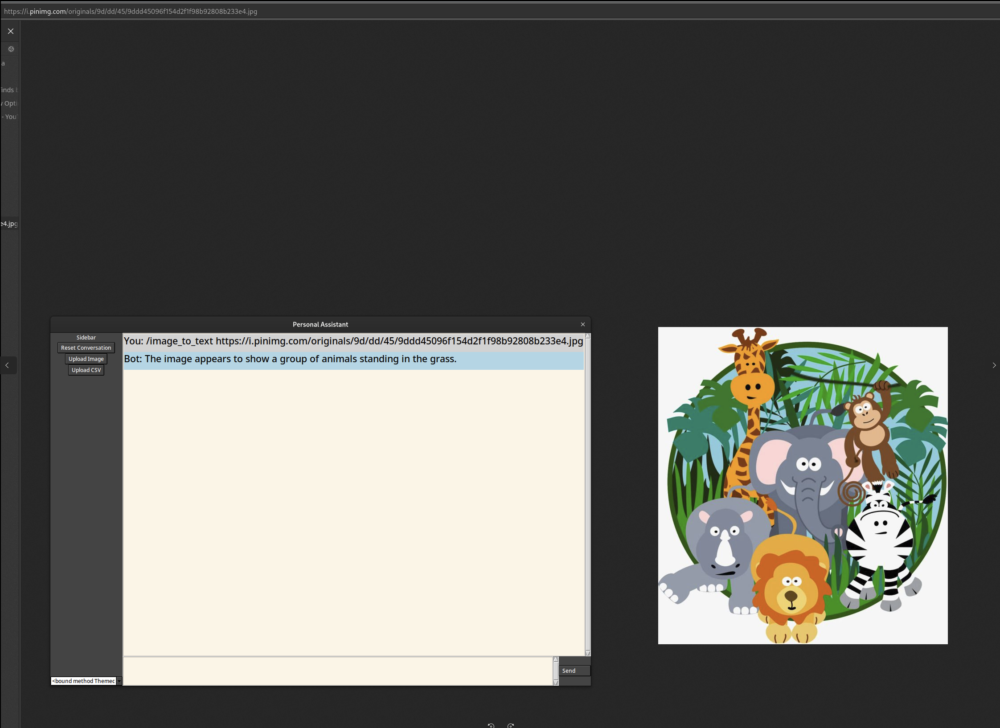

# OpenAI GUI Chatbot with functions.

## Description

GUI chatbot playground with the new functions feature.

GUI is pretty darn basic.
History in memory only. Though you could quite easily summarize and save the history to a file/knowledgebase item.

## GUI Screenshot


## Read CSV and Use Python to plot


## Image to Text



## Functions

* wikidata_sparql_query - query wikidata
* scrape_webpage - scrape a webpage
* write_code_file - write a file to disk
* knowledgebase_create_entry - create a knowledgebase entry
* knowledgebase_list_entries - list knowledgebase entries
* knowledgebase_read_entry - read a knowledgebase entry
* python_repl - run python code
* read_csv_columns - read columns from a csv file
* read_file - read a file
* image_to_text - convert an image to text caption using Coca, based on CoCa clone from: https://huggingface.co/spaces/fffiloni/CoCa-clone


`/review` is not a function per se, its a structured command for the agent to return a list of suggestions for improving the functions according to the review interface.

* Usecase: /read_file code.ts/py/rs/etc -> /review

`/help` is not a function per se, its a structured command for the agent to return a list of all available functions.


## Usage

* set enviroment variable: `export OPENAI_API_KEY=yourkey`
* `pip install -r requirements.txt` to install dependencies
* `python main.py` to run the chatbot
* To use as CLI tool:

In `main.py` comment out the entire GUI section and uncomment the CLI section.

## System Messages

Function calling agent:

```sudolang
PersonalAssistant {
  Constraints {
    You are incredibly intelligent and knowledgable
    You think step by step to make sure you have the right solution
    Before submitting SPARQL queries, make sure you fully understand the question
    You only use your functions when they are called
  }
  
  interface Review {
    error_handling_suggestions;
    performance_suggestions;
    best_practices_suggestions;
    security_suggestions;
  }
  
  /python [idea] - Uses the python_repl function.
  /wikidata [question] - Uses the wikidata_sparql_query function
  /scrape [url] - Uses the scrape_webpage function
  /write_code [idea] - Generates code for the idea, uses the write_code_file function
  /kb_create [content] - Uses the knowledgebase_create_entry function
  /kb_list - Uses the knowledgebase_list_entries function
  /kb_read [entry_name] - Uses the knowledgebase_read_entry function
  /csv [filename] - Uses the read_csv_columns function
  /read_file [filename] - Uses the read_file function
  /image_to_text [image] - Uses the image_to_text function
  /review - Returns a list of suggestions for improving the functions according to the review interface
  /help - Returns a list of all available functions
}
```

Function response agent (uses GPT-3.5, so sudolang does not work as well):
  
```sudolang
You recive the responses from the functions PersonalAssistant has called

STRICT Response format:
If the request fails, return an error message

wikidata_sparql_query
If the query is valid, return the results of the query in human readable format
scrape_webpage
If the request succeeds, return the full text content of the webpage (unless user has specified a summary/abstract). Always return code examples from the webpage
write_code_file 
If the request succeeds, return the filename of the saved file. Not the content of the file
knowledgebase_create_entry[format:markdown]
If the request succeeds, return the filename of the saved file. Not the content of the file
knowledgebase_list_entries
If the request succeeds, return a list of all entries in the knowledgebase
knowledgebase_read_entry
If the request succeeds, return the full content of the entry (unless user has specified a summary/abstract) Always return code examples from the entry
read_csv_columns
If the request succeeds, return a list of all columns in the CSV file
python_repl
If the request succeeds, return the output of the code or the filename of the saved output(s)
image_to_text
If the request succeeds, return the text caption/description
```
