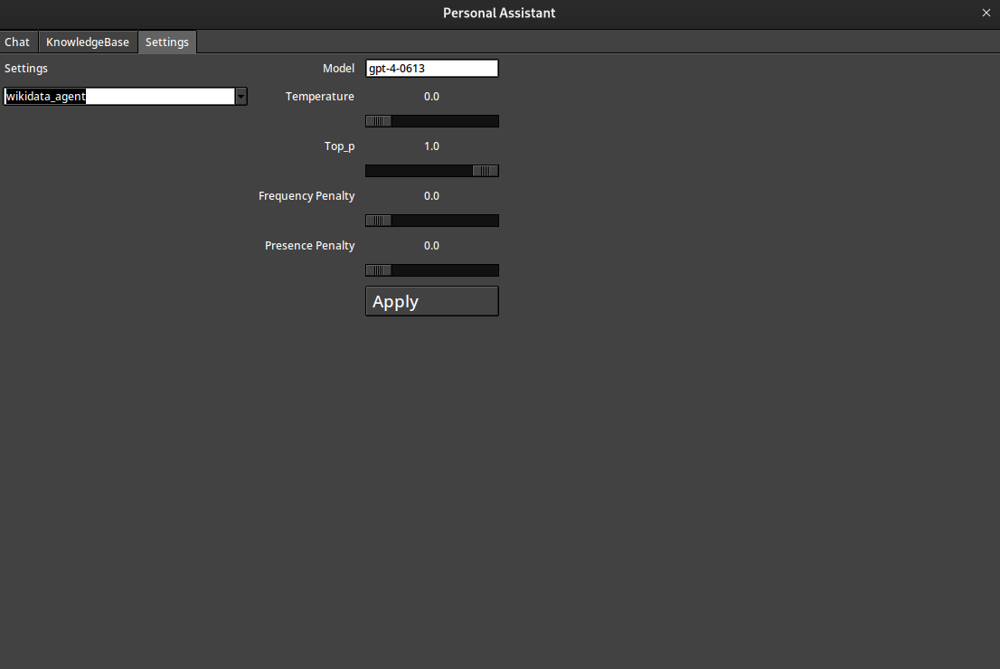

# GPT-UglyUI

## Table of Contents

- [Description](#description)
- [TODO](#todo--wants--would-if-i-could)
- [Functions](#functions)
- [Usage](#usage)
- [Screenshots](#gui-screenshots)
  - [Chat UI](#chat-ui)
  - [File-Manager](#file-manager)
  - [Settings](#settings-tab)
  - [Read CSV and Plot with Python](#read-csv-and-use-python-to-plot-older-gui)

## Description

GUI chatbot playground with the new functions feature.

* Somewhat basic GUI - Not threaded, so it freezes when the bot is thinking.
* History is in practice in memory (though you can save files with functions so, summarize and save)
* I have begun an attempt at adding a tab for Pinecone indexe, where you can search and view results. (very early days)
* File manager - can load file content into  chat history, to "talk to files" - supports most text based files.

### Limitations

* Very much single threaded so the GUI freezes when the bot is thinking.
* Can not copy from the chat window. (Workaround, ask it to write to file)
* I don't know python.
* Probably many more.

### TODO / Wants / Would if I could

* Integration with Vector DB (A tab for it in the UI with upload/search/embed/etc)
* Settings tab for configuring the parameters of the different agents
* gpt-engineer function to start a new gpt-engineer interaction
* Streamed responses live updated in UI. Not sure how to get around threading (or how to do it generally), especially for running python code.
* Refactor the UI code to be more modular and less spaghetti
* Probably more

## Functions

* /help - lists these commands
* /csv - csv handler
* /python - python interpreter
* /kb - knowledge base handler [read, write, list]
* /history - history handler [read, write, list] - Useful if you only want to summarize history
* /write - file writer chooses between `data/`, `data/code/` and `data/code/projects` depending on what it's asked to write
* /read - file reader
* /edit - file editor
* /wikidata - wikidata sparql handler
* /image - image to text captioner
* /scrape - web scraper 
* /save 'filename' - saves entire conversation history to file in history folder

### Not "functions" but commands/strict prompts

* review - performs a review of the code following a strict response format
* brainstorm [n] - returns a list of n ideas for the topic following a strict response format
* ticket - creates a ticket for the brainstorm following a strict response format
* help - returns a list of all available functions

Example Usecase: /read_file code.ts/py/rs/etc -> /review -> /edit_file code.ts/py/rs/etc

## Usage

* Create a .env file in the root of the project:
  - OPENAI_API_KEY=your-api-key
  - PINECONE_API_KEY=your-api-key
  - PINECONE_ENVIRONMENT=your-environment
* `pip install -r requirements.txt` to install dependencies
* `python main.py` to run the chatbot

## GUI Screenshots

### Chat UI

### File-Manager

### Settings Tab

### Read CSV and Use Python to plot (older GUI)

